# 🏗️ HASHIRU/SUPEREZIO - Diagrama de Arquitetura e Relacionamentos

## 📐 Visão Arquitetural do Sistema

```mermaid
graph TB
    %% User Interface Layer
    UI[🎨 Chainlit Interface<br/>chainlit.md + public/]
    
    %% Main Entry Points
    MAIN[🚀 main.py<br/>Enterprise Entry Point]
    AGENT[🤖 main_agent_superezio.py<br/>Core Agent]
    ENTERPRISE[🏢 superezio_enterprise/main.py<br/>Enterprise Demo]
    
    %% Configuration Layer
    CONFIG[⚙️ config.py<br/>Basic Config]
    AUTO_CONFIG[🔧 autonomous_config.py<br/>Modern Config]
    ENT_CONFIG[🏗️ superezio_enterprise/config.py<br/>Enterprise Config]
    
    %% Core Systems
    CMD_REG[📋 Command Registry<br/>Dynamic Command Loading]
    ORCHESTRATOR[🎯 api/orchestrator.py<br/>Expert Orchestration]
    
    %% Expert System
    EXPERTS[🧠 AI Experts<br/>api/experts/]
    FUND[📊 Fundamental Analyst]
    TECH[💹 Technical Analyst]
    SENT[🎭 Sentiment Analyst]
    CRYPTO[💰 Crypto Analyst]
    MACRO[🌍 Macro Analyst]
    RISK[⚠️ Risk Analyst]
    
    %% Enterprise Infrastructure
    ENT_INFRA[🏗️ Enterprise Infrastructure]
    HEALTH[🏥 Health Manager]
    CACHE[💾 Cache System]
    CIRCUIT[🔌 Circuit Breaker]
    RATE[🛡️ Rate Limiter]
    SESSION[🔄 Session Manager]
    HARDWARE[🖥️ Hardware Manager]
    LOGGING[📝 Structured Logging]
    SECURITY[🔒 Security Framework]
    
    %% Tools and Automation
    TOOLS[🛠️ Tools Layer]
    AUTO[🤖 Automation Commands]
    WEB[🌐 Web Automation]
    FS[📁 File System]
    EXEC[🔧 Command Execution]
    PYEXEC[🐍 Python Execution]
    NET[🌍 Network Operations]
    SELFMOD[🔄 Self Modification]
    
    %% Utilities
    UTILS[🔧 Utilities]
    AUDIT[🔍 Audit System]
    SEC_UTIL[🛡️ Security Utils]
    PATHS[📁 Path Management]
    GUARD[🛡️ Guards]
    
    %% External Systems
    LLM[🧠 LLM Models<br/>Ollama/DeepSeek/Llama]
    GPU[🎮 GPU Hardware<br/>RTX 3060 + RTX 2060]
    
    %% Connections - User Flow
    UI --> MAIN
    UI --> AGENT
    UI --> ENTERPRISE
    
    %% Configuration Flow
    CONFIG --> AUTO_CONFIG
    AUTO_CONFIG --> ENT_CONFIG
    ENT_CONFIG --> MAIN
    ENT_CONFIG --> AGENT
    
    %% Command Processing Flow
    MAIN --> CMD_REG
    AGENT --> CMD_REG
    CMD_REG --> TOOLS
    CMD_REG --> ORCHESTRATOR
    
    %% Expert System Flow
    ORCHESTRATOR --> EXPERTS
    EXPERTS --> FUND
    EXPERTS --> TECH
    EXPERTS --> SENT
    EXPERTS --> CRYPTO
    EXPERTS --> MACRO
    EXPERTS --> RISK
    
    %% Enterprise Infrastructure Connections
    MAIN --> ENT_INFRA
    ENT_INFRA --> HEALTH
    ENT_INFRA --> CACHE
    ENT_INFRA --> CIRCUIT
    ENT_INFRA --> RATE
    ENT_INFRA --> SESSION
    ENT_INFRA --> HARDWARE
    ENT_INFRA --> LOGGING
    ENT_INFRA --> SECURITY
    
    %% Tools Connections
    TOOLS --> AUTO
    TOOLS --> WEB
    TOOLS --> FS
    TOOLS --> EXEC
    TOOLS --> PYEXEC
    TOOLS --> NET
    TOOLS --> SELFMOD
    
    %% Utilities Connections
    TOOLS --> UTILS
    UTILS --> AUDIT
    UTILS --> SEC_UTIL
    UTILS --> PATHS
    UTILS --> GUARD
    
    %% External Connections
    ORCHESTRATOR --> LLM
    EXPERTS --> LLM
    HARDWARE --> GPU
    
    %% Styling
    classDef userLayer fill:#ff6b35,stroke:#333,stroke-width:2px,color:#fff
    classDef entryLayer fill:#4fc3f7,stroke:#333,stroke-width:2px,color:#fff
    classDef configLayer fill:#66bb6a,stroke:#333,stroke-width:2px,color:#fff
    classDef coreLayer fill:#ffa726,stroke:#333,stroke-width:2px,color:#fff
    classDef expertLayer fill:#ab47bc,stroke:#333,stroke-width:2px,color:#fff
    classDef infraLayer fill:#ef5350,stroke:#333,stroke-width:2px,color:#fff
    classDef toolsLayer fill:#26a69a,stroke:#333,stroke-width:2px,color:#fff
    classDef utilsLayer fill:#5c6bc0,stroke:#333,stroke-width:2px,color:#fff
    classDef externalLayer fill:#8d6e63,stroke:#333,stroke-width:2px,color:#fff
    
    class UI userLayer
    class MAIN,AGENT,ENTERPRISE entryLayer
    class CONFIG,AUTO_CONFIG,ENT_CONFIG configLayer
    class CMD_REG,ORCHESTRATOR coreLayer
    class EXPERTS,FUND,TECH,SENT,CRYPTO,MACRO,RISK expertLayer
    class ENT_INFRA,HEALTH,CACHE,CIRCUIT,RATE,SESSION,HARDWARE,LOGGING,SECURITY infraLayer
    class TOOLS,AUTO,WEB,FS,EXEC,PYEXEC,NET,SELFMOD toolsLayer
    class UTILS,AUDIT,SEC_UTIL,PATHS,GUARD utilsLayer
    class LLM,GPU externalLayer
```



## 🔄 Fluxo de Dados Principal

### 1. **Inicialização do Sistema**
```
1. main.py carrega configurações enterprise
2. Inicializa módulos de infraestrutura (cache, health, logging)
3. Configura hardware manager (GPUs)
4. Registra comandos dinamicamente
5. Inicia interface Chainlit
```

### 2. **Processamento de Comando**
```
Usuário Input → Chainlit UI → Command Registry → 
Roteamento (Tools vs API) → Execução → LLM (se necessário) → 
Resposta → Streaming → UI
```

### 3. **Expert System Flow**
```
Query → Orchestrator → Dynamic Expert Loading → 
Multiple Expert Analysis → Result Aggregation → 
Formatted Response
```

### 4. **Enterprise Monitoring**
```
All Operations → Structured Logging → Correlation IDs → 
Health Checks → Metrics Collection → Observability Dashboard
```

---

## 🏛️ Padrões Arquiteturais Utilizados

### 1. **Dependency Injection**
- Container DI em `superezio_enterprise/src/superezio/config/container.py`
- Injeção de dependências para desacoplamento

### 2. **Factory Pattern**
- Expert loading via factory pattern
- Dynamic command registration

### 3. **Singleton Pattern**
- Hardware Manager singleton
- Configuration singletons

### 4. **Strategy Pattern**
- Different expert strategies for analysis
- Multiple LLM model strategies

### 5. **Observer Pattern**
- Health monitoring
- Metrics collection

### 6. **Circuit Breaker Pattern**
- Fault tolerance para services externos
- Proteção contra cascading failures

---

## 🔌 Integrações e Dependências

### **Dependências Principais**
```python
chainlit==2.6.5          # UI Framework
python-dotenv>=1.0.0     # Environment Management
requests==2.32.4         # HTTP Client
pandas==2.3.1            # Data Analysis
numpy==2.3.2             # Numerical Computing
psutil==7.0.0            # System Monitoring
httpx==0.27.0            # Async HTTP Client
redis>=4.2.0             # Caching Backend
```

### **Integrações Externas**
- **Ollama**: Gerenciamento de modelos LLM
- **CUDA/NVIDIA**: Gerenciamento de GPU
- **Selenium**: Automação web
- **Redis**: Cache distribuído
- **FastAPI**: API backend (via Chainlit)

---

## 📊 Métricas de Complexidade

### **Arquitetural**
- **Camadas**: 6 camadas principais
- **Módulos**: ~15 módulos principais
- **Componentes**: ~50+ componentes
- **Padrões**: 6+ padrões arquiteturais

### **Code Metrics**
- **Total Files**: 110+ Python files
- **Main Modules**: 15 módulos core
- **Test Coverage**: 7 test suites
- **Documentation**: 5+ README files

### **Dependency Graph**
```
main.py (Root)
├── superezio_enterprise/* (20+ files)
├── api/* (12+ files)  
├── tools/* (15+ files)
├── utils/* (7+ files)
└── tests/* (7+ files)
```

---

## 🚀 Pontos de Extensibilidade

### 1. **New Expert Integration**
```python
# Adicionar novo expert em api/experts/
class NewExpert(BaseExpert):
    def analyze(self, data): pass

expert_definition = ExpertDefinition(
    name="new_expert",
    expert_class=NewExpert
)
```

### 2. **New Command Registration**
```python
# Adicionar comando em tools/
@command_registry.register("new_command")
async def new_command_handler(args):
    return "Command result"
```

### 3. **New Health Check**
```python
# Adicionar health check
health_manager.register_check("custom_check", custom_check_func)
```

### 4. **New Metrics Collection**
```python
# Adicionar métricas customizadas
metrics_collector.register_metric("custom_metric", metric_func)
```

---

## 🔒 Security Architecture

### **Input Validation Layer**
- Sanitização em `utils/security.py`
- Path validation em `utils/paths.py`
- Command whitelisting

### **Authorization Layer**
- Command permission checking
- File access controls
- Rate limiting por usuário

### **Audit Layer**
- Complete audit trail em `utils/audit.py`
- Structured logging com correlation IDs
- Change tracking para self-modification

---

## 🎯 Performance Optimization

### **Async Architecture**
- Full async/await implementation
- Non-blocking I/O operations
- Concurrent request handling

### **Caching Strategy**
- Multi-level caching (memory + Redis)
- TTL-based cache invalidation
- Cache warming strategies

### **Resource Management**
- GPU load balancing
- Memory monitoring
- Connection pooling

### **Streaming Responses**
- Real-time response streaming
- Backpressure control
- Progressive loading

---

*Diagrama gerado em: 2025-01-24*  
*Sistema analisado: HASHIRU/SUPEREZIO Enterprise Edition v6.0.0*